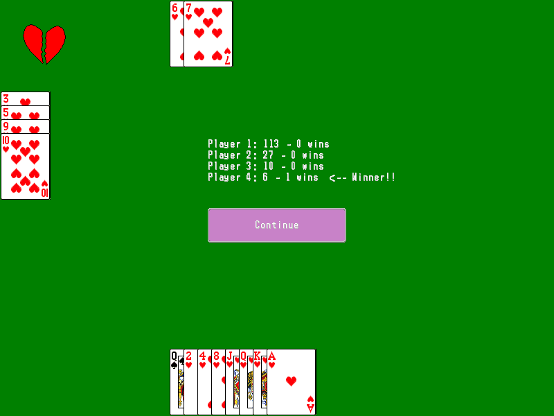

# Project Hearts version 1.1, 6th September 2013

## Introduction

I've added a few features that I wanted, mostly to show off that I can complete a set task. Hopefully the program will be sufficient proof, as long as job interviewers don't look at the code.

## Instructions

Drop the "rsc" folder into the same directory as the executable  
To select a card, click on it  
To pass three cards at the start of the round, select them and press the pass button  
Try to keep your score as low as possible by avoiding the hearts cards, and the queen of spades  

## Copyright

Copyright (c) Kayne Ruse 2011, 2012, 2013

This software is provided 'as-is', without any express or implied warranty. In no event will the authors be held liable for any damages arising from the use of this software.

Permission is granted to anyone to use this software for any purpose, including commercial applications, and to alter it and redistribute it freely, subject to the following restrictions:

   1. The origin of this software must not be misrepresented; you must not claim that you wrote the original software. If you use this software in a product, an acknowledgment in the product documentation would be appreciated but is not required.

   2. Altered source versions must be plainly marked as such, and must not be misrepresented as being the original software.

   3. This notice may not be removed or altered from any source distribution.

## Contact information

krgamestudios@gmail.com  
Current Build: https://www.dropbox.com/s/gqo2qqj6v1pejyq/Hearts%20by%20Kayne%20Ruse.rar?dl=1  
